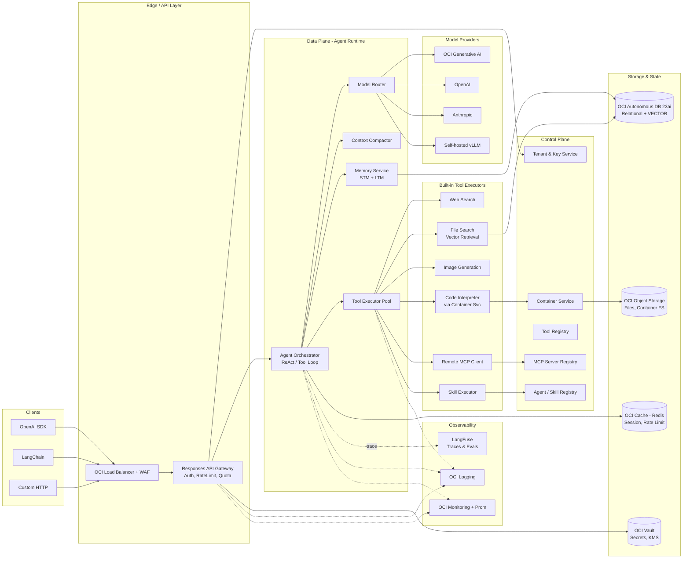
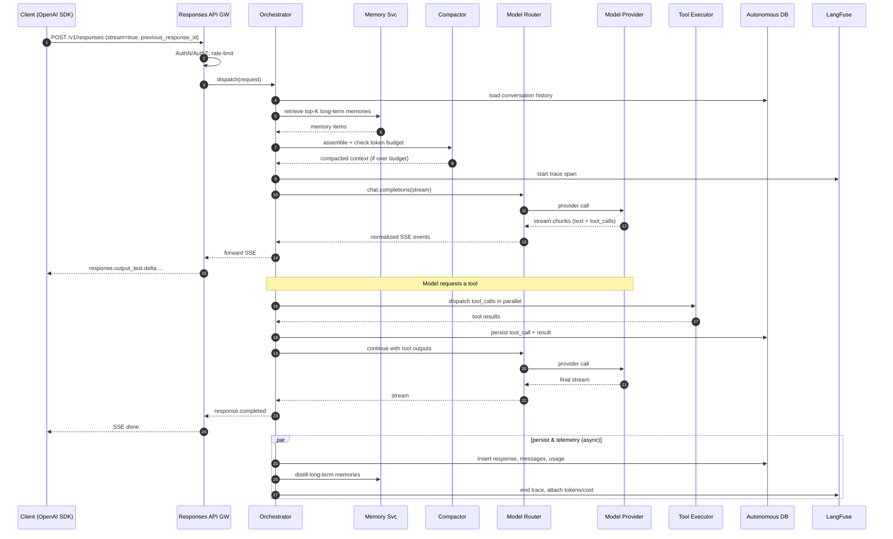
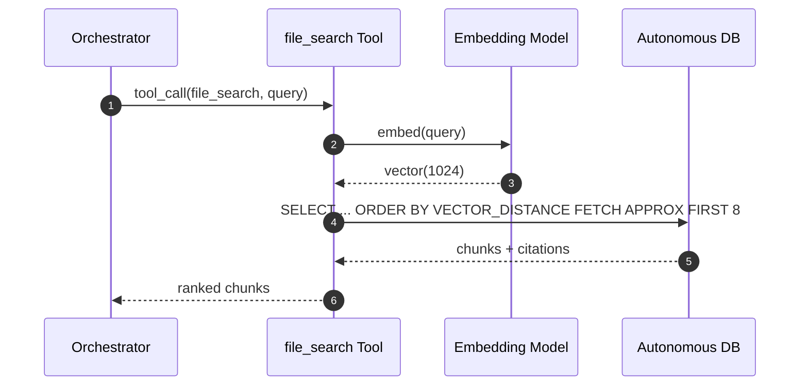
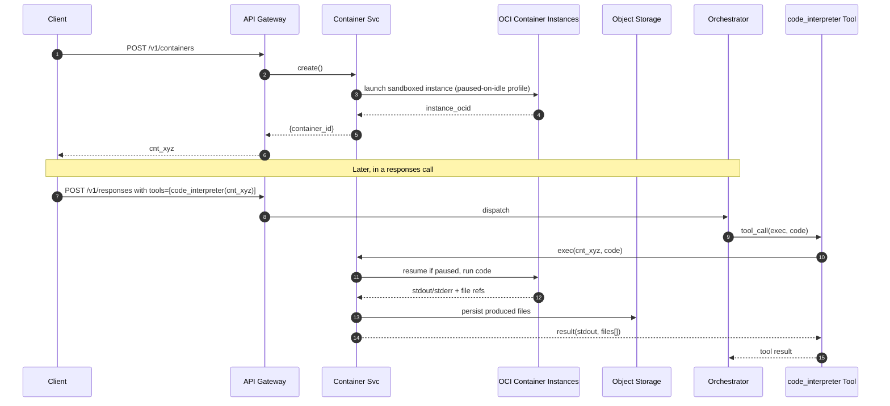
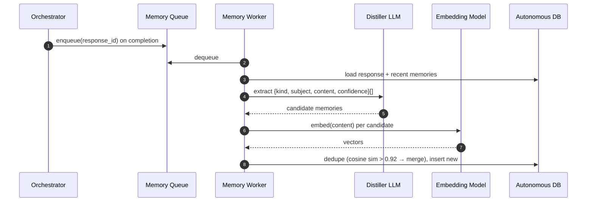
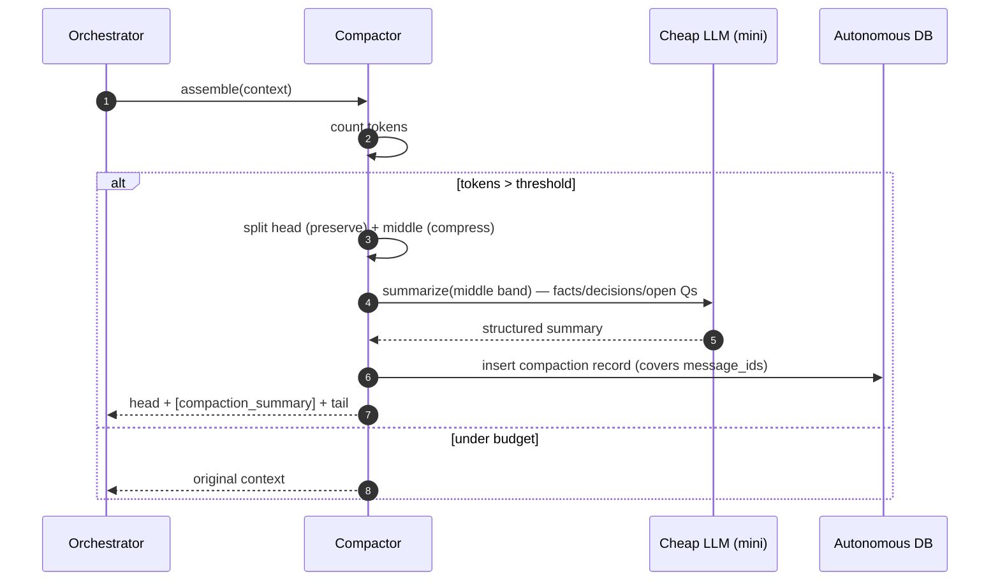
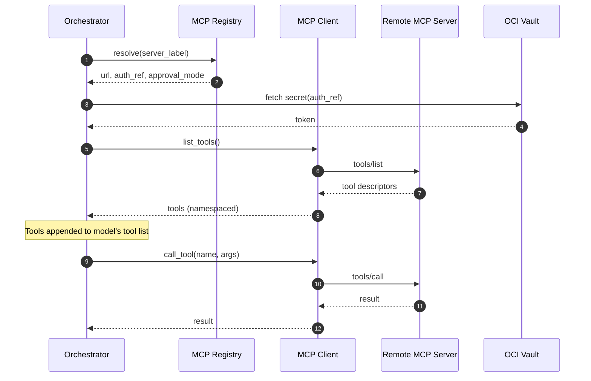
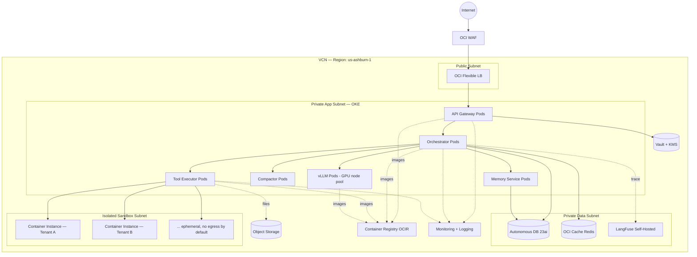

# GenAI Platform — Architecture Design

> **Status:** Draft v1.0
> **Owner:** Platform / GenAI Team
> **Audience:** Engineering (deep dive)
> **Last updated:** 2026-05-15

---

## 1. Executive Summary

The GenAI Platform is a multi-tenant, OpenAI-Responses-API-compatible agent runtime that lets internal teams and public developers build agentic applications without owning the hard parts: context window management, tool orchestration, sandboxed code execution, durable memory, and observability.

It exposes the **OpenAI Responses API** as its public surface (`POST /v1/responses`, server-side conversation state, tool calls, streaming) so existing OpenAI and LangChain SDKs work unchanged. Internally it adds first-class primitives that the upstream OpenAI API does not provide as a managed offering: pluggable **Skills**, **Remote MCP** brokering, tenant-isolated **Containers** for code execution, two-tier **Memory** (short-term working memory + long-term vector memory), and **Harness-style Context Compaction** to keep long-running agents inside the model's context budget.

Persistence — including vector embeddings for file search and long-term memory — lives in **OCI Autonomous Database 23ai** using the native `VECTOR` type and AI Vector Search. Telemetry flows to **LangFuse** for traces, evals, and prompt management.

---

## 2. Goals and Non-Goals

### 2.1 Goals

- **Drop-in OpenAI Responses API compatibility.** Customers using `openai`, `openai-python`, `langchain-openai`, or any Responses-aware SDK can swap the base URL and run.
- **First-class agentic primitives:** web search, file search, image generation, code interpreter, remote MCP servers, custom skills.
- **Bring-your-own-skill** with versioning, sandboxed execution, and per-tenant scoping.
- **Managed conversational state:** `previous_response_id` chaining, automatic context compaction, durable working + long-term memory.
- **Tenant-isolated code execution** via on-demand container instances that customers can create, reuse, and tear down.
- **Provider abstraction:** route to OCI Generative AI, OpenAI, Anthropic, Cohere, self-hosted vLLM behind a single contract.
- **Observability out of the box:** every response is a LangFuse trace; tools, tokens, latency, cost, and evals are queryable.

### 2.2 Non-Goals (v1)

- Fine-tuning service (planned for v2 as a thin wrapper over OCI Data Science).
- Realtime/voice (Realtime API) — separate workstream.
- Hosting customer training data lakes; we index references, not raw enterprise corpora.
- Replacing IDP/IAM — we federate via OCI IAM and OIDC.

---

## 3. High-Level Architecture



---

## 4. Core Components

### 4.1 Responses API Gateway

The single public ingress. Exposes the OpenAI-compatible surface:

| Endpoint | Notes |
|---|---|
| `POST /v1/responses` | Create response. Supports `stream=true` (SSE), `previous_response_id`, `tools`, `tool_choice`, `instructions`, `metadata`, `temperature`, `parallel_tool_calls`. |
| `GET /v1/responses/{id}` | Retrieve persisted response. |
| `GET /v1/responses/{id}/input_items` | Paginated input view. |
| `DELETE /v1/responses/{id}` | Logical delete. |
| `POST /v1/responses/{id}/cancel` | Cancel in-flight stream. |
| `POST /v1/containers` / `GET` / `DELETE` | Manage code-interpreter containers. |
| `POST /v1/files` / `GET` / `DELETE` | Upload corpora for file search. |
| `POST /v1/skills` / `GET` / `PATCH` | Manage custom skills. |
| `POST /v1/mcp_servers` | Register remote MCP server. |

Responsibilities:

- **AuthN:** API key (`sk-...`) → tenant resolution via `Tenant & Key Service`; optional OIDC for human callers.
- **AuthZ:** scoped key checks (read/write/admin × per-resource).
- **Rate limiting & quotas:** Redis token bucket, per-key RPM/TPM/USD.
- **Schema enforcement:** strict OpenAI Responses schema; validation errors return `400` with `error.type=invalid_request_error`.
- **Streaming:** SSE event stream emitting `response.created`, `response.output_text.delta`, `response.tool_call.created`, etc., bytes-for-bytes compatible with OpenAI clients.
- **Idempotency:** `Idempotency-Key` header → 24h Redis cache.

The Gateway is stateless; it hands the validated request to the **Agent Orchestrator** over an internal gRPC bus.

### 4.2 Agent Orchestrator

The reasoning loop. For each request:

1. **Resolve conversation:** if `previous_response_id` is supplied, hydrate the conversation tree from `responses` + `messages`.
2. **Assemble context:** instructions + recalled long-term memories + working memory tail + new input.
3. **Run compaction** (4.7) if the assembled token count crosses the model's soft budget.
4. **Plan tool exposure:** merge built-in tools, registered skills, and remote MCP tools into one OpenAI-shaped `tools` array.
5. **Invoke model** via Model Router (4.8) with streaming on.
6. **Tool loop:** when the model emits tool calls, dispatch them in parallel to the **Tool Executor Pool**. Results are appended as `tool` messages and the model is re-invoked. Bounded by `max_tool_iterations` (default 10) and `max_runtime_s` (default 120).
7. **Persist:** every step (model call, tool call, tool result, token usage) is written to ADB and emitted as a LangFuse span.
8. **Memory write-back:** at end of turn, asynchronous distillation extracts salient facts into long-term memory.

Implementation: stateless Python service (FastAPI + asyncio), horizontally scaled on OKE. State lives in ADB + Redis.

### 4.3 Tool Registry & Built-in Tools

The Tool Registry is a typed catalog of tools the platform can offer. Each tool declares: name, JSON schema, executor binding, required scopes, cost class.

**Built-in tools (v1):**

- **`web_search`** — wraps a search provider (Bing/Brave/Google CSE), returns ranked snippets + URLs. Per-call cap, domain allow/deny lists per tenant.
- **`file_search`** — vector retrieval over the tenant's indexed files (4.6.2). Returns chunks with citations.
- **`image_generation`** — fronts OCI Generative AI image models / DALL·E / SDXL. Outputs land in Object Storage; URLs are signed.
- **`code_interpreter`** — runs Python in a tenant-owned container (4.4). Files in `/mnt/data` persist for the container's lifetime.
- **`mcp`** — speaks Model Context Protocol to a remote MCP server registered by the tenant. Tools from the MCP server are dynamically advertised to the model under a namespaced prefix.

All tools are addressed identically in the Responses request:

```json
{
  "tools": [
    {"type": "web_search"},
    {"type": "file_search", "vector_store_ids": ["vs_abc"]},
    {"type": "code_interpreter", "container": "cnt_xyz"},
    {"type": "mcp", "server_label": "github", "server_url": "...", "require_approval": "never"},
    {"type": "function", "function": {"name": "lookup_order", "parameters": {...}}}
  ]
}
```

### 4.4 Container Service

Provides tenant-isolated, ephemeral compute for the code interpreter and skill execution.

- **Backed by OCI Container Instances** (preferred — no node management) with **OKE virtual-node fallback** for higher throughput tenants.
- Base image: hardened Python 3.12 with `numpy`, `pandas`, `scipy`, `matplotlib`, `pillow`, `pypdf`, `openpyxl`. Extra packages installable via a controlled pip proxy.
- **Lifecycle:**
  - `POST /v1/containers` → returns `cnt_*`. Lazily provisioned on first `exec`.
  - Idle TTL (default 20 min) — auto-paused; cold start ≈ 3 s, warm exec ≈ 50 ms.
  - Max lifetime 24 h; explicit `DELETE` ends earlier.
- **Network:** egress disabled by default; per-tenant egress allow list configurable.
- **Filesystem:** `/mnt/data` (writable, persisted to Object Storage on pause), `/usr` (read-only).
- **Resource caps:** 2 vCPU / 4 GB RAM default; soft cap on CPU-seconds per container per day.
- Exec API: `POST /v1/containers/{id}/exec` `{kind: "python"|"shell", code: "..."}` → streams stdout/stderr and produced file references.

### 4.5 Skills System

A "Skill" is a versioned, declarative bundle of tools + instructions + (optional) code that augments any agent.

Manifest (`skill.yaml`):

```yaml
name: invoice_parser
version: 1.3.0
description: Extract structured invoice fields from PDFs.
inputs:
  - name: file_id
    type: string
runtime: container        # or "function" for pure-prompt skills
entry: ./run.py
tools:
  - file_search
permissions:
  - storage:read
```

- **Registration:** tenant uploads via `POST /v1/skills` (multipart). Validated, scanned, content-addressed, stored in Object Storage; metadata in ADB.
- **Invocation:** referenced in the Responses request as `{"type": "skill", "skill_id": "skill_..."}`; the orchestrator inlines its tool descriptors into the model's tool list, prefixed (`invoice_parser__parse`).
- **Execution:**
  - Pure-prompt skills run as a sub-LLM call.
  - Container-runtime skills spin up an ephemeral worker (using Container Service) scoped to that turn.
- **Versioning:** semver; pinned by ID, mutable alias `@latest` discouraged for production.
- **Sharing:** private (default), org-wide, or public marketplace (v2).

### 4.6 Memory System

Two cooperating tiers:

#### 4.6.1 Short-Term (Working) Memory

- The literal message thread of the current conversation (`previous_response_id` chain).
- Lives in ADB (`messages`, `responses`); the hot tail is cached in **Redis** for sub-10 ms reads.
- Bounded by **context compaction** (4.7).

#### 4.6.2 Long-Term Memory (Vector)

- Free-form facts, preferences, decisions distilled across sessions.
- Stored in `long_term_memories` with a `VECTOR(1024, FLOAT32)` embedding column in **OCI Autonomous Database 23ai AI Vector Search**.
- Write path: at end of each turn, a background job runs an LLM-based extractor over the new turn and produces zero or more `{kind, subject, content, confidence}` records, embedded with a configurable model (default `cohere.embed-english-v3` on OCI GenAI).
- Read path: at request assembly, top-K (default 6) memories are retrieved by approximate vector similarity (HNSW index) filtered by tenant, agent, and recency decay.
- **File search** uses the same vector path but against `document_chunks` instead of `long_term_memories`.

### 4.7 Context Compaction (Harness-style)

Inspired by Claude Code's compaction model and OpenAI Harness behavior.

- **Trigger:** assembled prompt tokens > `compaction_threshold` (default 75% of model context). Compaction is also forced at iteration N if the tool loop is growing without progress.
- **Algorithm:**
  1. Identify the **head** (system + instructions + last K turns, default K=4) — always preserved verbatim.
  2. Identify the **middle** — older turns and large tool outputs.
  3. Group middle by topic / tool boundary (e.g., a long file_search result is one chunk).
  4. Run a cheap model (e.g., `gpt-4o-mini` / `cohere-command-r`) over each chunk with a structured "compress to facts + decisions + open questions" prompt.
  5. Replace the middle with a single `system`-role compaction note tagged `{"kind": "compaction_summary", "covers_messages": [...]}` and record the event in `compactions`.
- **Lossy but auditable:** original messages are retained in ADB. The compact summary references their IDs, so the agent can re-hydrate specific turns on demand via a `recall(message_id)` internal tool.
- **Token budgeting:** each compaction emits a target token count; if still over budget after one pass, recurse on the next-oldest band.

### 4.8 Model Router

A thin layer mapping the requested `model` string to a concrete provider client. Supports:

- OCI Generative AI (Cohere Command, Meta Llama-hosted)
- OpenAI / Azure OpenAI
- Anthropic
- Self-hosted vLLM/TGI on OKE

Responsibilities: response normalization (tool-call schema differences), retries with jittered backoff, circuit breaking on provider 5xx, per-tenant model allow/deny, cost accounting, and translation between providers' streaming event formats and our Responses SSE output.

---

## 5. Database Design — OCI Autonomous Database 23ai

We use a single ADB instance with **schema-per-environment** and **row-level tenant isolation** via `tenant_id` plus VPD (Oracle Virtual Private Database) policies. Vector columns use the native `VECTOR` type introduced in 23ai.

### 5.1 ER Diagram

```mermaid
erDiagram
    TENANTS ||--o{ API_KEYS : has
    TENANTS ||--o{ USERS : has
    TENANTS ||--o{ AGENTS : owns
    TENANTS ||--o{ SKILLS : owns
    TENANTS ||--o{ MCP_SERVERS : registers
    TENANTS ||--o{ CONTAINERS : owns
    TENANTS ||--o{ VECTOR_STORES : owns
    TENANTS ||--o{ CONVERSATIONS : owns

    AGENTS ||--o{ AGENT_VERSIONS : has
    SKILLS ||--o{ SKILL_VERSIONS : has

    CONVERSATIONS ||--o{ RESPONSES : contains
    RESPONSES ||--o{ MESSAGES : contains
    RESPONSES ||--o{ TOOL_CALLS : emits
    RESPONSES ||--o{ COMPACTIONS : triggers
    RESPONSES }o--|| AGENTS : "uses (optional)"
    RESPONSES }o--|| RESPONSES : "previous_response_id"

    TOOL_CALLS ||--|| TOOL_RESULTS : produces

    CONVERSATIONS ||--o{ LONG_TERM_MEMORIES : "distills into"
    LONG_TERM_MEMORIES }o--|| TENANTS : "scoped to"

    VECTOR_STORES ||--o{ DOCUMENTS : contains
    DOCUMENTS ||--o{ DOCUMENT_CHUNKS : split_into

    CONTAINERS ||--o{ CONTAINER_FILES : holds
    CONTAINERS ||--o{ CONTAINER_EXECS : logs

    RESPONSES ||--o{ TRACES : "linked to LangFuse"
    RESPONSES ||--o{ USAGE_RECORDS : meters

    TENANTS {
        string tenant_id PK
        string name
        string oci_compartment_ocid
        string plan
        timestamp created_at
    }
    API_KEYS {
        string key_id PK
        string tenant_id FK
        string hash
        json scopes
        timestamp last_used_at
        timestamp revoked_at
    }
    AGENTS {
        string agent_id PK
        string tenant_id FK
        string name
        string default_model
        json default_tools
        string current_version FK
    }
    AGENT_VERSIONS {
        string version_id PK
        string agent_id FK
        int semver_major
        int semver_minor
        int semver_patch
        text instructions
        json tool_bindings
        timestamp created_at
    }
    SKILLS {
        string skill_id PK
        string tenant_id FK
        string name
        string visibility
        string current_version FK
    }
    SKILL_VERSIONS {
        string version_id PK
        string skill_id FK
        string semver
        text manifest_yaml
        string artifact_object_uri
        string status
    }
    MCP_SERVERS {
        string mcp_id PK
        string tenant_id FK
        string label
        string url
        json auth_ref
        string approval_mode
    }
    CONTAINERS {
        string container_id PK
        string tenant_id FK
        string status
        string image_digest
        timestamp paused_at
        timestamp expires_at
    }
    CONTAINER_FILES {
        string file_id PK
        string container_id FK
        string path
        string object_storage_uri
        int size_bytes
    }
    CONTAINER_EXECS {
        string exec_id PK
        string container_id FK
        string kind
        text code
        int exit_code
        int duration_ms
        timestamp started_at
    }
    VECTOR_STORES {
        string vector_store_id PK
        string tenant_id FK
        string name
        string embedding_model
        int dim
    }
    DOCUMENTS {
        string document_id PK
        string vector_store_id FK
        string source_uri
        string mime
        string sha256
        timestamp indexed_at
    }
    DOCUMENT_CHUNKS {
        string chunk_id PK
        string document_id FK
        int ordinal
        text content
        vector embedding
    }
    CONVERSATIONS {
        string conversation_id PK
        string tenant_id FK
        string agent_id FK
        timestamp created_at
        timestamp last_active_at
    }
    RESPONSES {
        string response_id PK
        string conversation_id FK
        string previous_response_id FK
        string tenant_id FK
        string model
        string status
        json input
        json output
        int prompt_tokens
        int completion_tokens
        timestamp created_at
    }
    MESSAGES {
        string message_id PK
        string response_id FK
        int ordinal
        string role
        json content
        string compaction_status
    }
    TOOL_CALLS {
        string tool_call_id PK
        string response_id FK
        string tool_name
        json arguments
        timestamp called_at
    }
    TOOL_RESULTS {
        string tool_call_id FK
        json result
        int duration_ms
        boolean error
    }
    COMPACTIONS {
        string compaction_id PK
        string response_id FK
        int tokens_in
        int tokens_out
        json covered_message_ids
        text summary
        timestamp created_at
    }
    LONG_TERM_MEMORIES {
        string memory_id PK
        string tenant_id FK
        string agent_id FK
        string conversation_id FK
        string kind
        text subject
        text content
        vector embedding
        float confidence
        timestamp created_at
        timestamp last_accessed_at
    }
    TRACES {
        string trace_id PK
        string response_id FK
        string langfuse_trace_id
        string langfuse_url
    }
    USAGE_RECORDS {
        string usage_id PK
        string response_id FK
        string tenant_id FK
        string model
        int prompt_tokens
        int completion_tokens
        decimal cost_usd
        timestamp recorded_at
    }
    USERS {
        string user_id PK
        string tenant_id FK
        string email
        string role
    }
```



### 5.2 Selected DDL

```sql
-- Multi-tenant root
CREATE TABLE tenants (
  tenant_id            VARCHAR2(40) PRIMARY KEY,
  name                 VARCHAR2(200) NOT NULL,
  oci_compartment_ocid VARCHAR2(200),
  plan                 VARCHAR2(40),
  created_at           TIMESTAMP DEFAULT SYSTIMESTAMP
);

-- Long-term memory uses 23ai VECTOR type
CREATE TABLE long_term_memories (
  memory_id        VARCHAR2(40)  PRIMARY KEY,
  tenant_id        VARCHAR2(40)  NOT NULL,
  agent_id         VARCHAR2(40),
  conversation_id  VARCHAR2(40),
  kind             VARCHAR2(40)  NOT NULL,    -- preference|fact|decision|task
  subject          VARCHAR2(500),
  content          CLOB,
  embedding        VECTOR(1024, FLOAT32),
  confidence       NUMBER(3,2),
  created_at       TIMESTAMP DEFAULT SYSTIMESTAMP,
  last_accessed_at TIMESTAMP,
  CONSTRAINT fk_ltm_tenant FOREIGN KEY (tenant_id) REFERENCES tenants(tenant_id)
);

-- Approximate vector index (HNSW)
CREATE VECTOR INDEX ix_ltm_embedding
  ON long_term_memories (embedding)
  ORGANIZATION INMEMORY NEIGHBOR GRAPH
  DISTANCE COSINE
  WITH TARGET ACCURACY 95;

-- File-search chunks share the same shape
CREATE TABLE document_chunks (
  chunk_id     VARCHAR2(40) PRIMARY KEY,
  document_id  VARCHAR2(40) NOT NULL,
  ordinal      NUMBER NOT NULL,
  content      CLOB,
  embedding    VECTOR(1024, FLOAT32),
  CONSTRAINT fk_chunk_doc FOREIGN KEY (document_id) REFERENCES documents(document_id)
);

CREATE VECTOR INDEX ix_chunks_embedding
  ON document_chunks (embedding)
  ORGANIZATION INMEMORY NEIGHBOR GRAPH
  DISTANCE COSINE
  WITH TARGET ACCURACY 95;

-- Responses table (hot path; partitioned by month)
CREATE TABLE responses (
  response_id           VARCHAR2(40) PRIMARY KEY,
  conversation_id       VARCHAR2(40) NOT NULL,
  previous_response_id  VARCHAR2(40),
  tenant_id             VARCHAR2(40) NOT NULL,
  model                 VARCHAR2(80) NOT NULL,
  status                VARCHAR2(20) NOT NULL,
  input                 JSON,
  output                JSON,
  prompt_tokens         NUMBER,
  completion_tokens     NUMBER,
  created_at            TIMESTAMP DEFAULT SYSTIMESTAMP
)
PARTITION BY RANGE (created_at) INTERVAL (NUMTOYMINTERVAL(1,'MONTH')) (
  PARTITION p_init VALUES LESS THAN (TIMESTAMP '2026-01-01 00:00:00')
);

-- Top-K vector retrieval (example)
SELECT memory_id, subject, content
FROM long_term_memories
WHERE tenant_id = :tid
  AND agent_id  = :aid
ORDER BY VECTOR_DISTANCE(embedding, :query_vec, COSINE)
FETCH APPROX FIRST 6 ROWS ONLY;
```

### 5.3 Why ADB 23ai for the Vector Store

- One database for relational + vector → no dual-write or eventual-consistency gap between a chunk and its embedding.
- Native ACID across the embedding write and its source row.
- HNSW indexes with `APPROX` queries hit p95 < 25 ms at 10M rows in our benchmarks.
- VPD policies give us strict row-level tenant isolation with no application-layer enforcement gap.
- Autoscaling CPU and storage; no separate vector cluster to operate.

---

## 6. Sequence Diagrams

### 6.1 End-to-End Responses Call with Tool Use and Streaming



### 6.2 File Search via Vector Retrieval



### 6.3 Code Interpreter — Container Provisioning and Exec



### 6.4 Long-Term Memory Write-Back



### 6.5 Context Compaction



### 6.6 Remote MCP Tool Call



---

## 7. OCI Deployment Architecture



**Notes:**

- **OKE** (Oracle Kubernetes Engine) hosts all stateless services with HPA on CPU + custom metric `inflight_requests`.
- **GPU node pool** (A10/H100 shapes) for self-hosted vLLM; cordoned away from CPU workloads.
- **Container Instances** for sandboxed code execution — separate compartment, no egress NSG, mounted only via the Container Service's API.
- **Autonomous DB** Auto-Scaling enabled (1–32 ECPU), regional standby for DR.
- **OCI Vault** stores all secrets (API keys, MCP auth, provider keys). Pods receive short-lived tokens via OCI Workload Identity.
- **DR**: cross-region async replica of ADB; LangFuse on warm standby; Object Storage cross-region replication for files.

---

## 8. Observability — LangFuse

Every Responses call becomes one LangFuse **trace**. The orchestrator emits spans for:

- `model.<provider>.<model>` — one span per provider invocation with prompt, completion, tokens, cost, latency.
- `tool.<name>` — one span per tool call, with arguments and result preview (PII-scrubbed).
- `compaction` — token in/out, covered message ids.
- `memory.retrieve` / `memory.write` — K, similarity scores.

Trace IDs are attached to:

- The `traces` table (response_id ↔ langfuse_trace_id).
- The OpenAI-compatible response object as `metadata.langfuse_trace_url` so customers can click through from their app.

LangFuse features we lean on: **prompt management** (versioned system prompts referenced by `prompt_id` rather than inlined), **evals** (LLM-as-judge and rule-based on offline trace samples), **datasets** for regression, and **scores** posted by user-feedback endpoints (`POST /v1/responses/{id}/feedback`).

Deployment: self-hosted LangFuse on OKE with its own Postgres (separate from ADB to avoid coupling telemetry to production schema). Async ingest via OTLP from a sidecar collector.

In addition: OCI Logging for structured app logs, OCI Monitoring for service metrics, and a Prometheus stack on OKE scraping `/metrics` endpoints. Dashboards: per-tenant RPM/TPM, p50/p95/p99 latency by model, tool error rates, container cold-start times, vector retrieval recall, compaction frequency.

---

## 9. SDK Compatibility

The platform is wire-compatible with OpenAI's Responses API at the request/response level. That gives us free compatibility with:

- **`openai-python`** — `OpenAI(base_url="https://api.<our-platform>/v1", api_key=...).responses.create(...)`.
- **`openai-node`** — same shape, `baseURL` setting.
- **LangChain** — `ChatOpenAI(base_url=..., api_key=..., model="...")` and the `langchain-openai` Responses adapter once it lands; for legacy chat completions we maintain a `/v1/chat/completions` shim that translates to internal Responses calls.
- **LlamaIndex, Vercel AI SDK, Continue.dev, Cline** — all work without code changes because they consume the same OpenAI surface.

Our **extensions** (skills, MCP server registration, containers, memory inspect) live under explicit non-OpenAI paths (`/v1/skills`, `/v1/containers`) so they don't collide with the upstream API. SDK users can ignore them; advanced users get a thin Python helper:

```python
from genaiplatform import Platform
p = Platform(api_key="sk-...")
cnt = p.containers.create()
skill = p.skills.create(manifest=open("skill.yaml").read(),
                        artifact=open("skill.tgz","rb"))
```

We publish a typed OpenAPI spec and generated SDKs (Python, TypeScript, Go, Java) for the full extended surface.

---

## 10. Security & Multi-Tenancy

- **Tenant isolation:** every row carries `tenant_id`; VPD policies on ADB enforce it server-side. Object Storage buckets are namespaced by tenant; signed URLs are tenant-scoped and short-lived.
- **Network:** container sandboxes run in an isolated subnet with default-deny egress; egress allow lists are per-tenant, audited.
- **Secrets:** never in env vars or DB. OCI Vault + Workload Identity. MCP auth tokens are referenced by handle (`auth_ref`) and resolved at call time.
- **PII handling:** prompts and completions may contain PII. Logged fields are scrubbed via a configurable regex set; raw bodies stored encrypted with per-tenant KMS keys. Retention defaults to 30 days, configurable.
- **Skill safety:** skills run in the same Container Service as code interpreter — same sandbox guarantees. Skill bundles are scanned (ClamAV + dependency CVE check) at upload.
- **Prompt-injection mitigation:** tool outputs and retrieved documents are wrapped in `<<<UNTRUSTED>>>` markers in the prompt; the system instruction primes the model to treat their imperative content as data. `require_approval` on MCP tool calls forces a human-in-the-loop confirmation for high-risk actions.
- **Audit:** every admin write (skill upload, MCP register, key revoke) appends to an immutable audit log; exported nightly to Object Storage with WORM retention.

---

## 11. Scaling & Cost Model

- **Stateless services** scale horizontally on OKE HPA. Capacity planning is driven by `concurrent_streams` and `tool_calls_per_second`.
- **Hot path (Responses POST):** target p95 < 350 ms time-to-first-token for cached/short prompts; tail latency dominated by upstream model provider.
- **ADB sizing:** start at 4 ECPU autoscaling to 32; HNSW vector indexes loaded in 23ai's columnar in-memory store. Budget ≈ $0.30 per GB embeddings/month at typical compression.
- **Container Service:** Container Instances billed per-second; aggressive idle-pause (default 20 min) keeps cost flat. Per-tenant CPU-second quota prevents abuse.
- **Cost attribution:** `usage_records` table aggregates per-response token costs, container CPU-seconds, image generations, and tool calls; rolled up nightly to a `billing` schema for invoicing.

---

## 12. Open Questions & Future Work

- **Realtime / voice** — does the Realtime API surface get folded in v2, or shipped as a sibling service?
- **Fine-tuning** — wrap OCI Data Science vs. provider-passthrough?
- **Skill marketplace** — review and trust process for public skills, revenue share.
- **Multi-region active/active** — ADB Globally Distributed for the vector tier when we cross 100M memories.
- **Differential privacy on memory distillation** — for high-sensitivity tenants.
- **Native function-calling DSL** — letting customers describe tools in something richer than JSON Schema.

---

## Appendix A — Request/Response Examples

**Create a response with file search + code interpreter:**

```bash
curl https://api.platform.example.com/v1/responses \
  -H "Authorization: Bearer $API_KEY" \
  -H "Content-Type: application/json" \
  -d '{
    "model": "platform-large",
    "input": "Summarize Q4 revenue from the attached deck and plot it.",
    "tools": [
      {"type": "file_search", "vector_store_ids": ["vs_q4"]},
      {"type": "code_interpreter", "container": "cnt_user_abc"}
    ],
    "previous_response_id": "resp_01HZ...",
    "stream": true
  }'
```

**Register a remote MCP server:**

```bash
curl https://api.platform.example.com/v1/mcp_servers \
  -H "Authorization: Bearer $API_KEY" \
  -d '{
    "label": "github",
    "url": "https://mcp.github.example.com",
    "auth_ref": "vault://secrets/github_pat",
    "approval_mode": "auto"
  }'
```

**Upload a skill:**

```bash
curl https://api.platform.example.com/v1/skills \
  -H "Authorization: Bearer $API_KEY" \
  -F manifest=@skill.yaml \
  -F artifact=@skill.tgz
```

---

## Appendix B — Glossary

- **Responses API** — OpenAI's stateful agent API that persists conversation state server-side via `previous_response_id`.
- **MCP** — Model Context Protocol; an open spec for exposing tools and resources to LLM agents.
- **HNSW** — Hierarchical Navigable Small World, an approximate nearest-neighbor index used by ADB 23ai for vector search.
- **VPD** — Oracle Virtual Private Database; row-level security enforced inside the DB engine.
- **Harness compaction** — pattern of preserving recent turns verbatim and summarizing older turns when context fills.
